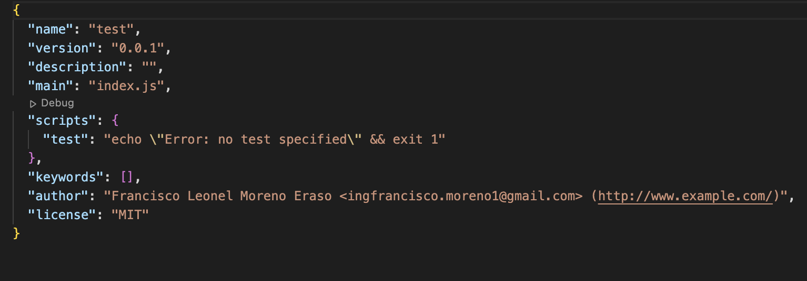

## NPM

In [SetApp](http) we focus on build the tools around technologies that we already use.
One of them is [NPM](http) who is in charge of generate our `package.json`, so in a fresh machine with the default config, it would look like:


There is some config, like the **description** that is different between projects and because of that, it's taken care with our tool

:::tip Please Check the Docs 🙏🏻
Please, check the `Cli Commands` documentation section for more info about this topic
:::

On the other hand we have common info that we could be shared between projects, for some of them, like the `License` or the `Version` we have default values (**ISC** and **1.0.0**). Other values like the `Author` are not even set.

:::info
This default behaviour could be changed! The following list of values could be set, and in fact, we recommend that!
:::

### Author Url

You could set your personal webpage

```bash
npm config set init-author-url="<URL>"
```

### License

You could set a default license (**current default value: `ISC`**)

```bash
npm config set init-license="<LICENSE>"
```

### Intial Version

You could set a default version (**current default value: `1.0.0`**)

```bash
npm config set init-version="<VERSION>"
```

### Author Email

You could set an author email to contact

```bash
npm config set init-author-email="<EMAIL>"
```

### Author Name

You could set a default author name

```bash
npm config set init-author-name"<NAME>"
```

If we execute those commands the result will be a `package.json` similar to the next one:



## README

Not only that, other tools used in `SetApp` use these values, for example our README generator: [readme-md-generator](https://github.com/kefranabg/readme-md-generator).

### Before


### After


## Full Example App

Running a command similar to:


The README generated would look like:


:::tip Have in mind 🙏🏻
More info will be added when we integrate with a `Github repo`, so the `package.json` and the `README` would have even more content
:::
