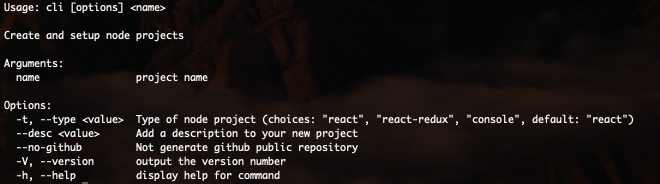

# Cli Arguments

## Getting Started

If we run the command help command:

```bash
npx @set-app/cli -h
```

We are going to find all the options available:



:::info Peace of advice 😉
`Version` and `Help` commands are not intended to use with other options and commands
:::

## Type Argument

The Tool was created to support 3 options: `React`, `React-Redux` and `Console`. `React` and `React-Redux` are implemented and `Console` will be release soon.

The default behaviour is `React`, if not `--type` is specified as you can see on [Basic Info](../basic-info.md)

`React-Redux`, option is covered on detail at [Other Projects Type](./other-projects-type.md)

## Description Argument

This option sets **description** attribute on `package.json` that is used by the [readme generator](https://github.com/kefranabg/readme-md-generator) to fill the also the **Readme description** section and also when we generate a **Github repository**.

## Github Argument

The Github repository generation is activated **by default** and with the argument `--no-github`, we deactivated.

By default a **Github public repository** will be created with the `name` that you chose and a `description`, if it was provided, plus a default `License`, taken from your npm configuration.

For more information, please check the blog about it.

:::warning Look out! 🧐
When you disable the `Github repo generation`, you disable the `Github Actions` too!
:::
